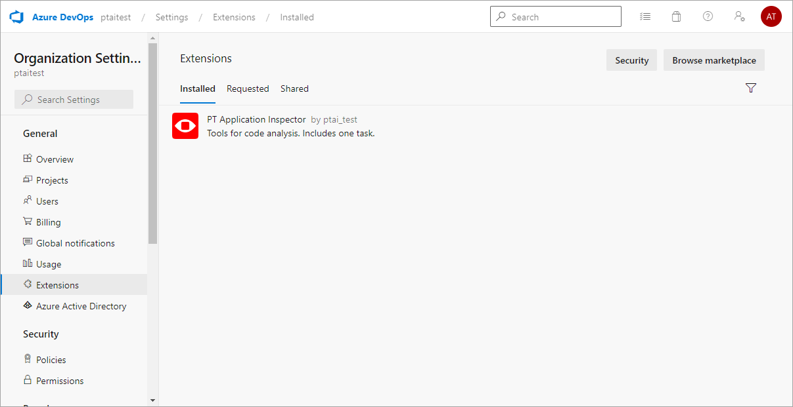
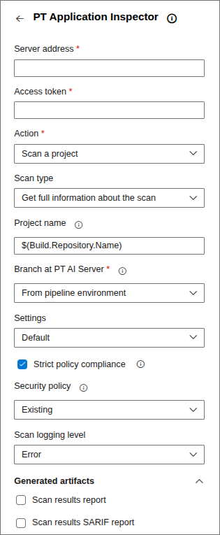
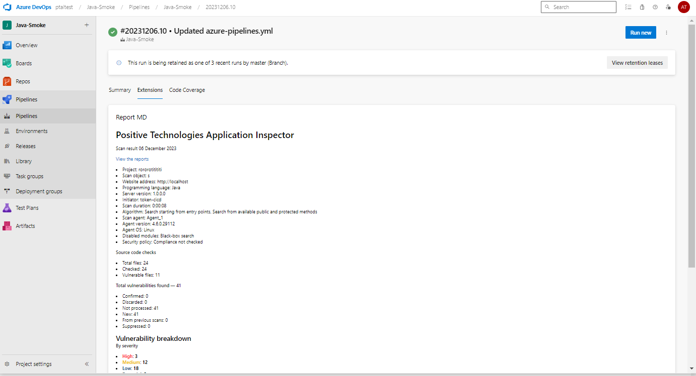

# AI.Plugin.Azure

Using the PT Application Inspector plugin for Azure DevOps, you can configure a template to start a pipeline through which settings will be sent to start a scan.

The scan start settings and source code will be sent to the server specified in the template.

PT AI contributes to higher product quality and reduces time for software development and QA as well as the labor intensity typical for manual analysis of vulnerabilities.

You can read more about PT AI operation in the user documentation supplied with the main PT AI product package.

## How it works

For the plugin to operate correctly, you need the following:
* Configured Azure DevOps build agents configured
* AI.Shell
* PT AI Enterprise Agent connected to PT AI Enterprise Server

AI.Shell is a light cross-platform agent that sends a scan task to the PT AI Enterprise Server module, and PT AI Enterprise Server queues the task to be performed by an available PT AI Enterprise Agent.

For more information about how to configure Azure DevOps build agents for [Linux](https://learn.microsoft.com/en-us/azure/devops/pipelines/agents/v2-linux?view=azure-devops) and [Windows](https://learn.microsoft.com/en-us/azure/devops/pipelines/agents/v2-windows?view=azure-devops#permissions), visit microsoft.com.

**Installing the plugin from Marketplace**

To upload the plugin to Marketplace:

1. Go to your organization's settings page.

2. On the main menu, click  and select **Browse Marketplace**.

3. Find **PT Application Inspector** plugin.

4. Click **Get it free**.

5. Select your organization and click **Install**.

The plugin is now installed.



**Creating a pipeline**

After installing the plugin, you need to create a pipeline to start the plugin.

To create a pipeline:

1. Go to your organization's page.

2. On the left side of the page, select **Pipelines** → **New pipeline**.

3. Select the version control system that contains source code for scanning.

4. Depending on the version control system, configure the connection to the scan project.

5. Select **Starter pipeline**.

6. Save the pipeline.

## Configuring a scan task

After installing the plugin and creating a pipeline, you can create a separate scan task for each scan project.

To set up a project task:

1. Select your project.

2. To the left, select **Pipelines**.

3. Select the previously created pipeline.

4. Click **Edit**.

5. Under **Tasks**, select the **PT Application Inspector** task .

6. In the `azure-pipelines.yml` file, delete the contents of the **pool** section and write `name: default`.

   ***Note.** If you want to scan large projects that take a long time to scan, you must set the scan task timeout in the `azure-pipelines.yml` file manually. The default value is 60 minutes. For example, `timeoutInMinutes 360 report`.*

7. Under **PT Application Inspector** in the **Server Address** box, specify the PT AI Enterprise Server address.

   
8. In the **Access token** box, enter the access token for the CI/CD plugins created earlier.

9. If you want to start a new scan, in the **Action** list, select **Scan a project**.

10. To check the status of the current scan, in the **Action** list, select **Check scan results**, and then enter values in the **Project ID** and **Scan result ID** boxes.

11. If you need to run a vulnerability check and you want to wait for the scan to finish, in the **Scan type** list, select **Get full information about scan**.

12. If you need to run a vulnerability check and continue running the pipeline without waiting for the scan to finish, in the **Scan type** list, select **Send scan on server and end task**.

13. In the **Project name** box, enter the name of the project created in the PT AI web interface.

14. In the **Branch at PT AI Server** list, select:
 - **From pipeline environment** if the name of the scanned branch is specified in the pipeline environment variable.
 - **Custom branch** if you need to specify a branch manually (enter a name in the **Branch name** field).

15. If a scan project is already configured in the PT AI web interface, in the **Settings** list, select **Default**.

16.  If you want to create a configuration file with the scan settings at the build stage, in the **Settings** list, select **Custom**.

Example of the `azure-pipelines.yml` file with scan settings:

```
- task: application-inspector-devops-plugin@0
  inputs:
    serverAddress: 'https://server_address'
    token: '<token_for_AISA>'
    actionMode: 'scan'
    branchAtServer: 'fromEnvironment'
    settingsType: 'enterNew'
    newSettings: |
      {
        "$schema": "https://json.schemastore.org/aiproj-1.1.json",
        "Version": "1.1",
        "ProjectName": "<project_name>",
        "ProgrammingLanguage": "Java",
        "ScanModules": [
            "DataFlowAnalysis"
        ],
        "CustomParameters": null,
        "UseSastRules": false,
        "UseCustomPmRules": false,
        "UseSecurityPolicies": false,
        "SkipGitIgnoreFiles": false,
        "UsePublicAnalysisMethod": true,
        "DownloadDependencies": true,
        "JavaSettings": {
            "Parameters": "",
            "UnpackUserPackages": false,
            "UserPackagePrefixes": "",
            "Version": "v1_8"
        },
        "MailingProjectSettings": {
            "Enabled": false,
            "MailProfileName": null,
            "EmailRecipients": []
        }
      }
    html: true
    sarif: true
```

## Configuring a security policy

To edit the security policy:

1. Under **PT Application Inspector**, select **Strict policy mode** to stop the pipeline if the scanned application does not comply with the set security policy.

2. If you want to use an existing security policy rule, in the **Security policy** list, select **Existing**.

3. If you want to add a new security policy rule or use a template, in the **Security policy** list, select **New**.

***Note.** In addition, you must check that **Check for compliance with the security policy** is selected in the web interface or the `“UseSecurityPolicies: true”` parameter is specified in the configuration file.*

Example of the `azure-pipelines.yml` file with security policy rules:

```
- task: application-inspector-devops-plugin@0
  inputs:
    serverAddress: 'https://server_address'
    token: '<token_for_AISA>'
    actionMode: 'scan'
    branchAtServer: 'fromEnvironment'
    policyScanType: 'enterNew'
    newPolicies: |
      [
        {
          "CountToActualize": 0,
          "Scopes": [
            {
              "Rules": [
                {
                "Field": "Level",
                "Value": "High",
                "IsRegex": false
                }
              ]
            }
          ]
        }
      ]
    html: true
    sarif: true
```

## Configuring logging

To configure logging:

1. Under **PT Application Inspector** in the **Scan logging level** list, select the severity level for events to be logged.

2. Select formats for reports to be generated based on scan results.

3. Start the project pipeline by clicking **Save**.

   If the scan results comply with the security policy, the pipeline will pass successfully.

## Reports

After the pipeline finishes running, scan reports are available. By clicking build artifacts, you can download the reports in the formats specified during the configuration of the `azure-pipelines.yml` file. The following formats are available for downloading: 
* Scan results report HTML
* Scan results SARIF report
* Autocheck report
* OWASP top 10 2021 report
* PCI DSS 3.2 report
* NIST 800-53 Rev. 4 report
* SANS top 25 report
* OWASP mobile top 10 2016 report
* Report EAL4 (GOST 15408-3)
* Scan results JSON report
* Scan results XML report

To view the default MD report, go to **Pipelines** → **Runs** → **Descriptions** → **Extensions**.



## Requirements

The plugin is compatible with the local version of Azure DevOps Server 2020 (update 1.1) and cloud versions of Azure DevOps Services.

For more information about the hardware and software requirements for PT AI Enterprise Server, PT AI Enterprise Agent and AI.Shell, see the Administrator Guide.
